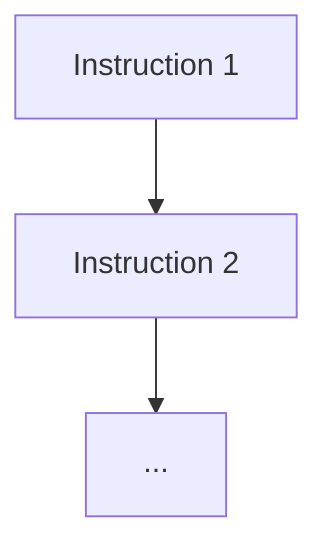
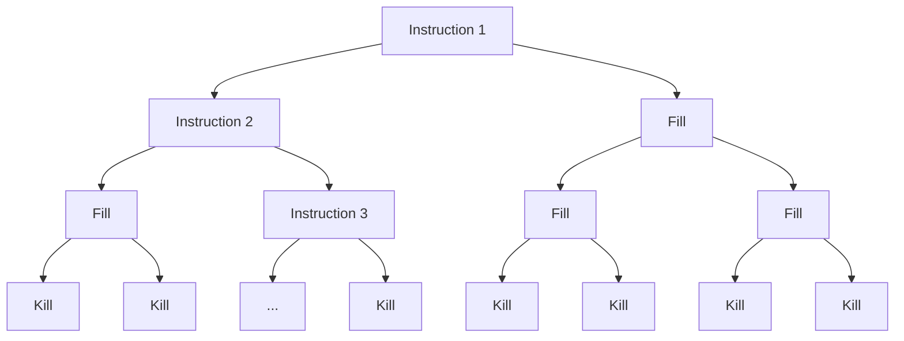

# Fork and Knife

## Table of Contents

[toc]

## Flag

`CCC{d0n7_347_m3}`

## Briefing

We have come across a program that needs a password, can you work out what it is? Download the program from [url].

By Oshawk.

## Infrastructure

Host for the program download.

## Risks

None since file download only.

## Building

```
cd src/
python3 graph.py
./assemble.sh
cp program ../build/download/
```

`program` must be less than or equal to 8192 bytes in length. The build process should be repeated until this is fulfilled.

## Explanation

This challenge involves fairly heavy assembly code obfuscation. A secret assembly program (`secret.asm`) is taken and each instruction is put into a tree like so:



Next fill nodes (instructions that do nothing) and kill nodes (instructions that segfault the program) are added to make a binary tree:



This means there is only one route through the tree that executes the program, all the others cause it to fault.

This tree is then encoded into something like:

```
struct node {
    left,
    right,
    instruction,
}
```

by `graph.py` and placed in the file `graph.asm`.

Another assembly program (`program.asm`) then uses the `fork()` sys call to traverse the tree (parent goes left, child right).

`header.asm` and `footer.asm` add metadata to make the assembly into a valid ELF executable.

`header.asm`, `graph.asm`, `program.asm` and `footer.asm` are then all joined together into `temp.asm` and assembled with NASM. `assemble.sh` automates this.

The outputted `program` now functions just like `secret.asm` however is heavily obfuscated. The fork instructions make it very hard to examine dynamically.

## Walkthrough

All files used throughout the walkthrough can be located in the `solution` directory.

### 1. Basic Understanding

```
$ ./program 
Enter the password: letmein
Incorrect :(
```

From the briefing and through running the program it appears that we need to work out some sort of password. Entering something random gives an incorrect message.


```
$ strings -n 6 program
Incorrect :(
Correct! :-)
Enter the password:
```

Running `strings` on the program reveals that there is a success message in addition to the failure message and the prompt. This must be what we are aiming for.


```
$ strace ./program
execve("./program", ["./program"], 0x7ffeb8517850 /* 24 vars */) = 0
strace: [ Process PID=42816 runs in 32 bit mode. ]
mprotect(0x8048000, 8192, PROT_READ|PROT_WRITE|PROT_EXEC) = 0
sigaction(SIGSEGV, {sa_handler=0x8049f5c, sa_mask=[], sa_flags=0}, NULL) = 0
fork()                                  = 42817
fork(Enter the password: )                                  = 42824
--- SIGSEGV {si_signo=SIGSEGV, si_code=SEGV_MAPERR, si_addr=0x508e62f} ---
waitpid(-1, NULL, 0)                    = 42824
--- SIGCHLD {si_signo=SIGCHLD, si_code=CLD_EXITED, si_pid=42824, si_uid=1000, si_status=0, si_utime=0, si_stime=0} ---
waitpid(-1, letmein
Incorrect :(
NULL, 0)                    = 42817
--- SIGCHLD {si_signo=SIGCHLD, si_code=CLD_EXITED, si_pid=42817, si_uid=1000, si_status=0, si_utime=0, si_stime=0} ---
waitpid(-1, NULL, 0)                    = -1 ECHILD (No child processes)
exit(0)                                 = ?
+++ exited with 0 +++
```

Running a basic `strace` in the program reveals three things:

1. The program first makes everything `RWX` via an `mprotect` syscall.
2. A `sigaction` is set up to catch segmentation faults. We should probably investigate the handler function (`0x08049f5c`) later.
3. Lots of `fork` syscalls seem to occur. Judging by the name of the challenge this is probably quite important.


```
$ strace -f ./program
execve("./program", ["./program"], 0x7ffe31743898 /* 24 vars */) = 0
strace: [ Process PID=43825 runs in 32 bit mode. ]
mprotect(0x8048000, 8192, PROT_READ|PROT_WRITE|PROT_EXEC) = 0
sigaction(SIGSEGV, {sa_handler=0x8049f5c, sa_mask=[], sa_flags=0}, NULL) = 0
... (31 lines chopped)
[pid 43832] write(1, "Enter the password: ", 20Enter the password:  <unfinished ...>
... (169 lines chopped)
[pid 43841] read(0, letmein
"letmein\n", 16)    = 8
... (2520 lines chopped)
[pid 44130] write(1, "Incorrect :(\n", 13Incorrect :(
) = 13
... (390 lines chopped)
exit(0)                                 = ?
+++ exited with 0 +++
```

Running `strace` with the `-f` option to follow forks produces over 3000 lines of output. Digging through this we can find the `read` syscall that reveals the passwords length the be 16 characters or less.

### 2. Advanced Understanding

```assembly
_start:
08049f25  b87d000000         mov     eax, 0x7d
08049f2a  bb00800408         mov     ebx, __elf_header
08049f2f  b900200000         mov     ecx, 0x2000
08049f34  ba07000000         mov     edx, 0x7
08049f39  cd80               int     0x80
08049f3b  e805000000         call    sub_8049f45
08049f40  e83e000000         call    sub_8049f83
```

It is time to take a closer look at the assembly code that makes up the program. Looking at the entry point we can see the `mprotect` syscall that we saw from the `strace` output as well as a couple of function calls.


```assembly
sub_8049f45:
08049f45  b843000000         mov     eax, 0x43
08049f4a  bb0b000000         mov     ebx, 0xb
08049f4f  b9819e0408         mov     ecx, 0x8049e81
08049f54  ba00000000         mov     edx, 0x0
08049f59  cd80               int     0x80
08049f5b  c3                 retn     {__return_addr}
```

Looking at the first function call we see the `sigaction` syscall that we observed earlier. Now would probably be a good time to examine the handler more closely.


```assembly
sub_8049f5c:
08049f5c  b807000000         mov     eax, 0x7
08049f61  bbffffffff         mov     ebx, 0xffffffff
08049f66  b900000000         mov     ecx, 0x0
08049f6b  ba00000000         mov     edx, 0x0
08049f70  cd80               int     0x80
08049f72  83f800             cmp     eax, 0x0
08049f75  7de5               jge     sub_8049f5c

08049f77  b801000000         mov     eax, 0x1
08049f7c  bb00000000         mov     ebx, 0x0
08049f81  cd80               int     0x80
```

Looking at the documentation for `sigaction` we see that the argument is in fact a data structure rather than a simple function. Luckily `strace` extracted the function address for us earlier.

The syscall in this function is `waitpid` which waits for the given process to terminate. As the given process is `-1`, any child process is waited for. This syscall keeps on being repeated until the return value is `-1` (no children) at which point the process exits gracefully via the `exit` syscall.

Putting this all together we see that if a process segfaults then it waits for all child processes to die before exiting. It is not clear why this is important just yet.


```assembly
sub_8049f83:
08049f83  e828000000         call    sub_8049fb0
08049f88  b802000000         mov     eax, 0x2
08049f8d  cd80               int     0x80
08049f8f  85c0               test    eax, eax
08049f91  740e               je      0x8049fa1

08049f93  a10d9f0408         mov     eax, dword [data_8049f0d]
08049f98  8b00               mov     eax, dword [eax]
08049f9a  a30d9f0408         mov     dword [data_8049f0d], eax
08049f9f  ebe2               jmp     sub_8049f83

08049fa1  a10d9f0408         mov     eax, dword [data_8049f0d]
08049fa6  8b4004             mov     eax, dword [eax+0x4]
08049fa9  a30d9f0408         mov     dword [data_8049f0d], eax
08049fae  ebd3               jmp     sub_8049f83
```

Now let's take a look at the second function called at the start of the program. It seems that another function is called followed by a `fork` syscall. If the result of the syscall is `0` (child) then one block of code is executed, otherwise (parent) the other block is executed.

Both blocks are pretty similar. They seem to:

1. Read an address from `0x8049f0d`.
2. Add an offset to this address (`0` for parent, `4` for child).
3. Read another address the first address (plus the offset).
4. Store the new address at `0x8049f0d`.
5. Loop back to the start of the function.

From this we can begin to deduce that there are a number of structures throughout the program that looks something like:

```
struct structure {
	structure *parent;
	structure *child;
}
```


```assembly
sub_8049fb0:
08049fb0  8b350d9f0408       mov     esi, dword [data_8049f0d]
08049fb6  83c608             add     esi, 0x8

08049fb9  8705119f0408       xchg    dword [data_8049f11], eax
08049fbf  871d159f0408       xchg    dword [data_8049f15], ebx
08049fc5  870d199f0408       xchg    dword [data_8049f19], ecx
08049fcb  87151d9f0408       xchg    dword [data_8049f1d], edx
08049fd1  9c                 pushfd
08049fd2  5f                 pop     edi
08049fd3  873d219f0408       xchg    dword [data_8049f21], edi
08049fd9  57                 push    edi
08049fda  9d                 popfd

08049fdb  ffd6               call    esi

08049fdd  8705119f0408       xchg    dword [data_8049f11], eax
08049fe3  871d159f0408       xchg    dword [data_8049f15], ebx
08049fe9  870d199f0408       xchg    dword [data_8049f19], ecx
08049fef  87151d9f0408       xchg    dword [data_8049f1d], edx
08049ff5  9c                 pushfd
08049ff6  5f                 pop     edi
08049ff7  873d219f0408       xchg    dword [data_8049f21], edi
08049ffd  57                 push    edi
08049ffe  9d                 popfd

08049fff  c3                 retn     {__return_addr}
```

Let's look at the last function now (called from `sub_8049f83`). In short is seems to:

1. Load an address from `0x08049f0d` (the structure we identified previously).
2. Add an offset of `8` to the address.
3. Swap the general purpose registers and flags with data from some memory locations.
4. Call the address (plus offset).
5. Restore the general purpose registers and flags.

Since we are calling the address (plus `8`) we can assume that it is a function. This means we can expand our structure to:

```
struct structure {
	structure *parent;
	structure *child;
	function fn;
}
```

Since we are exchanging the registers before and after calling an `fn`, `fn`s and the rest of the program must almost act independently of one another.


```assembly
08049f0d  int32_t data_8049f0d = 0x8048a30
```

```assembly
08048a30  int32_t data_8048a30 = 0x8049d7c
08048a34  int32_t data_8048a34 = 0x8049c01

sub_8048a38:
08048a38  b804000000         mov     eax, 0x4
08048a3d  c3                 retn     {__return_addr}
```

Looking at `0x08049f0d` the address of the first structure. Going to that address we confirm our suspicions, two addresses followed by a function.

### 3. Solving

Looking at the structure it seems awfully like a binary tree node with `fn` being the value and `parent` and `child` being the branches. This would mean that the program is traversing the binary tree by, for each node, the parent going down one branch and the child going down the other.

If this is the case then every possible route through the tree would be executed. Since every route has independent memory and registers, only one of the routes can hold the password checking program and the rest must be superfluous (perhaps they segfault and get caught by `sigaction`).

So, our goal is to find this valid route. There are a couple of ways we could do this.

### 3.1. Dynamic

```
$ strace -o trace -ff ./program
Enter the password: letmein
Incorrect :(
$ ls -1 trace*
trace.17107
trace.17108
trace.17109
trace.17110
trace.17111
trace.17112
trace.17113
trace.17114
trace.17115
... (300 lines snipped)
trace.17418
trace.17419
trace.17420
trace.17421
trace.17422
trace.17423
trace.17424
```

Running `strace` with the `-ff` flag causes a separate file to be created for each fork. With the last `write` syscall as a starting point we can trace backwards to identify the correct route through the tree. I will write a script to do this and produce a series of GDB commands to extract the inner program.


```python
from glob import glob


# Function to find the process file that contains a particular string.
# Returns the pid as well as the position of the string in the file.
def find(text):
    for path in glob("trace.*"):
        with open(path) as f:
            position = f.read().find(text)
            if position != -1:
                return path.split(".")[-1], position

    return None, None


# Locate the starting process.
previous, _ = find("Incorrect")
order = []

# Following the parent enough times at the end to extract the full program.
with open(f"trace.{previous}") as f:
    parent_times = f.read().count("fork()")

order += ["parent"] * parent_times

# Looping until the start of the program.
while True:
    current, position = find(previous)

    # Nowhere left to go. Must be the start of the program.
    if current is None:
        break

    # The number of forks before the fork that takes the correct path
    # is the number of times to follow the parent process.
    with open(f"trace.{current}") as f:
        parent_times = f.read().count("fork()", 0, position) - 1

    order.append("child")  # Follow the fork that takes the correct path.
    order += ["parent"] * parent_times

    previous = current

# Initial setup to enable logging and set a breakpoint berore the call.
output = """set disassembly-flavor intel
set logging on
b *0x8049fdb
r < /dev/random
ni
x/i $pc
set follow-fork-mode """

# Continue to the breakpoint. Advance. Examine the function. Follow correctly.
output += """
c
ni
x/i $pc
set follow-fork-mode """.join(order[::-1])
output += """
c
ni
x/i $pc
"""

print(output)
```

```
$ python3 solver.py 
set disassembly-flavor intel
set logging on
b *0x8049fdb
r < /dev/random
ni
x/i $pc
set follow-fork-mode child
c
ni
x/i $pc
set follow-fork-mode parent
c
ni
x/i $pc
set follow-fork-mode parent
c
... (390 lines snipped)
```

We can now run the commands to extract the inner program.


```
$ grep "=>" gdb.txt | cut -f2 > solution
```

And finally we can clean the output.

### 3.2 Static

To extract the inner program statically we could first locate a node near the end of the tree via cross reference to the `Incorrect :(` string. After this we could continue cress referencing backwards until the start of the tree is reached. Since the dynamic solution works well I won't actually do this but it is an option in theory.

### 4. Finishing Off

```assembly
mov    eax,0x4
mov    ebx,0x1
mov    ecx,0x8049aab
mov    edx,0x14
int    0x80

mov    eax,0x3
mov    ebx,0x0
mov    ecx,0x8048c0c
mov    edx,0x10
int    0x80

mov    edx,0x0
mov    al,ds:0x8048c0c
cmp    al,0x43
jne    0x8048ab3

mov    al,ds:0x8048c0d
add    al,0x20
cmp    al,0x63
jne    0x8048ab3

mov    al,ds:0x8048c0e
add    al,0x13
cmp    al,0x56
jne    0x8048ab3

mov    al,ds:0x8048c0f
xor    al,0x7b
cmp    al,al
jne    0x8048ab3

mov    al,ds:0x8048c10
sub    al,0x64
cmp    al,al
jne    0x8048ab3

mov    al,ds:0x8048c11
xor    al,0x72
cmp    al,0x42
jne    0x8048ab3

mov    al,ds:0x8048c12
xor    al,0x91
xor    al,0xff
cmp    al,al
jne    0x8048ab3

mov    al,ds:0x8048c13
mov    bl,0x76
and    bl,0x53
xor    al,bl
cmp    al,0x65
jne    0x8048ab3

mov    al,ds:0x8048c14
sub    al,BYTE PTR ds:0x8048c0c
cmp    al,0x1c
jne    0x8048ab3

mov    al,ds:0x8048c15
xor    al,BYTE PTR ds:0x8048c10
cmp    al,0x57
jne    0x8048ab3

mov    al,ds:0x8048c16
mov    bl,BYTE PTR ds:0x8048c0f
xor    bl,BYTE PTR ds:0x8048c12
xor    al,bl
cmp    al,0x21
jne    0x8048ab3

mov    al,ds:0x8048c17
xor    al,BYTE PTR ds:0x8048c16
sub    al,0x3
cmp    al,al
jne    0x8048ab3

mov    al,ds:0x8048c18
cmp    al,BYTE PTR ds:0x8048c14
jne    0x8048ab3

mov    al,ds:0x8048c19
mov    bl,BYTE PTR ds:0x8048c11
mov    cl,BYTE PTR ds:0x8048c16
xor    bl,cl
add    al,bl
cmp    al,0x71
jne    0x8048ab3

mov    al,ds:0x8048c1a
xor    al,BYTE PTR ds:0x8048c19
xor    al,BYTE PTR ds:0x8048c18
xor    al,BYTE PTR ds:0x8048c17
xor    al,BYTE PTR ds:0x8048c16
xor    al,BYTE PTR ds:0x8048c15
xor    al,BYTE PTR ds:0x8048c14
xor    al,BYTE PTR ds:0x8048c13
xor    al,BYTE PTR ds:0x8048c12
xor    al,BYTE PTR ds:0x8048c11
xor    al,BYTE PTR ds:0x8048c10
xor    al,BYTE PTR ds:0x8048c0f
xor    al,BYTE PTR ds:0x8048c0e
xor    al,BYTE PTR ds:0x8048c0d
xor    al,BYTE PTR ds:0x8048c0c
cmp    al,0x5b
jne    0x8048ab3

mov    al,ds:0x8048c1b
dec    al
dec    al
cmp    al,BYTE PTR ds:0x8048c0f
jne    0x8048ab3

mov    eax,0x4
mov    ebx,0x1
mov    ecx,0x8049880
test   edx,edx
jne    0x8048f05

mov    edx,0xd
int    0x80

mov    eax,0x1
dec    si
cmp    al,BYTE PTR ds:0x3039c29
```

```assembly
sub_8048ab3:
08048ab3  42                 inc     edx
08048ab4  c3                 retn     {__return_addr}
```

```assembly
sub_8048f05:
08048f05  b99e920408         mov     ecx, 0x804929e
08048f0a  c3                 retn     {__return_addr}
```

Now to solve the extracted program:

- First there is a `write` syscall outputting the `Enter the password:` message.
- Next there is a `read` syscall that takes the password and stores it at `0x8048c0c`.
- Throughout the program there are many conditional jumps to `0x8048ab3`:
  - These jumps increment `edx`.
  - Looking at the bottom of the program, the password is only accepted if `edx` is `0`.
  - We therefore must try and avoid these jumps.
- The characters of the password seem to be checked in order.
- The first character is compared to `0x43`, which is the ASCII code for  `C`.
- `0x20` is added to the second character, this is then compared to `0x63`. `0x63 - 0x20 = 0x43 = C`.
- `0x13` is added to the third character, this is then compared to `0x56`. `0x56 - 0x13 = 0x43 = C`.
- The forth character is XORed with `0x7b` and then compared with `0x00`. `0x7b ^ 0x00 = 0x7b = {`.
- `0x64` is subtracted from the fifth character, the result is the compared to `0x00`. `0x64 + 0x00 = 0x64 = d`.
- The sixth character is XORed with `0x72` and the result is compared to  `0x42`. `0x72 ^ 0x42 = 0x30 = 0`.
- The seventh character is XORed with `0x91` and `0xff`, the result is compared to `0x00`. `0x91 ^ 0xff ^ 0x00 = 0x6e = n`.
- The eighth character is XORed with (`0x76` AND `0x53`), this is compared to `0x65`. `(0x76 & 0x53) ^ 0x65 = 0x37 = 7`.
- The first character (`0x43 = C`) is subtracted from the ninth character, the result is compared to `0x1c`. `0x43 + 0x1c = 0x5f = _`.
- The tenth character is XORed with the fifth character (`0x64 = d`), the result is compared to `0x57`. `0x64 ^ 0x57 = 0x33 = 3`.
- The eleventh character is compared to the forth character (`0x7b = {`) and the seventh character (`0x6e = n`), the result is compared to `0x21`. `0x7b ^ 0x6e ^ 0x21 = 0x34 = 4`.
- The twelfth character is XORed with the eleventh character (`0x34 = 4`), `0x03` is subtracted from the result which is then compared to `0x00`. `(0x00 + 0x03) ^ 0x34 = 0x37 = 7`.
- The thirteenth character is compared to the ninth character (`0x5f = _`). `0x5f = 0x5f = _`.
- The sixth character (`0x30 = 0`) XORed with the eleventh character (`0x34 = 4`), the fourteenth character is then added to this and the result is compared to `0x71`. `0x71 - (0x30 ^ 0x34) = 0x6d = m`.
- The fifteenth and all previous characters are XORed together, the result is compared to `0x5b`. `0x43 ^ 0x43 ^ 0x43 ^ 0x7b ^ 0x64 ^ 0x30 ^ 0x6e ^ 0x37 ^ 0x5f ^ 0x33 ^ 0x34 ^ 0x37 ^ 0x5f ^ 0x6d ^ 0x5b = 0x33 = 3`.
- The sixteenth character is decremented twice and compared to the forth character (`0x7b = {`). `0x01 + 0x01 + 0x7b = 0x7d = }`.


```
$ ./program
Enter the password: CCC{d0n7_347_m3}
Correct! :-)
```

Putting this all together we get the flag `CCC{d0n7_347_m3}`.
